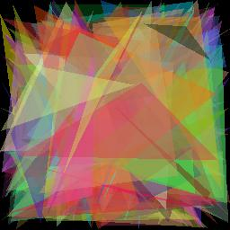

# Replicating Images with Triangles

## About the Program

This program recreates images through the use of an asexual reproduction algorithm.
A image is taken in as input and stored to be used for rating the **fitness** of a
generated image (how similar the image is to the original). Generated images contain
several colored triangles with RGBA values.

Example run:

Generation 0 \


Generation 5000 \


The program then runs as follows:

1. `n` images are created per generation and have `m` triangles drawn onto them.
   - Triangles have colors (RGBA values) and 3 edge coordinates (x, y).
   - The number of triangles to be drawn is a constant variable in `canvas.py` defined as
     `NUM_TRIANGLES`.
2. Each image generated is compared to the source image and the difference in pixels
   (RGB) is calculated. This is called the **fitness** of the state. The image with the
   least difference is selected to be the successor.
3. The triangles are taken from the parent and assigned to each of the `n` images. Then
   the triangles are given a chance to mutate changing their color and size. Mutation rate
   can be adjusted in `triangle.py`.

## Execution

### Dependencies

- Python 3.7+
- PIP Packages:
  - Pillow - https://pypi.org/project/Pillow/
  - NumPy - https://numpy.org/

The program should be run following the following format:

```
# Unix-based
python3 main.py {relative image path} {# of images per generation}

# Windows
py .\main.py {relative image path} {# of images per generation}
```

Ex:

```
python3 main.py images/apple.jpg 100
```

## Samples

All samples are located in the `samples` directory. The setting for each of the samples are
provided below:

| Image     | Population per Generation | # of Triangles | Mutation Rate |
| :-------: | :-----------------------: | :------------: | :-----------: |
| flag.jpg  | 100                       | 256            | 5%            |
| apple.jpg | 200                       | 512            | 7.5%          |
| odu.webp  | 250                       | 1024           | 5%            |
